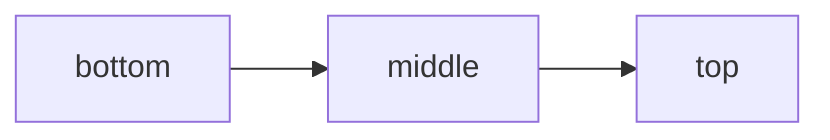

# Strict PVP (SPVP) v0.0.0.0

This is a versioning system that’s compatible with [the Haskell Package Versioning Policy](https://pvp.haskell.org/), but tries to prevent more issues with dependencies.

The key words "MUST", "MUST NOT", "REQUIRED", "SHALL", "SHALL NOT", "SHOULD", "SHOULD NOT", "RECOMMENDED",  "MAY", and "OPTIONAL" in this document are to be interpreted as described in [RFC 2119](https://datatracker.ietf.org/doc/html/rfc2119).

1. TOC
{:toc}

## terminology

- __bump__: this aligns with SemVer’s requirements, which are stricter than PVP here. “bumping” a component in a version means _incrementing_ that component while resetting all less-significant components to zero. (PVP doesn’t require resetting the less-significant components, but it’s certainly allowed and generally followed in practice.) __NB__: Because not all versions may be released, or may be unavailable for some reason, in practice it may appear as if the weaker requirements of PVP were followed (components increased instead of strictly incremented, and less significant components not reset).

- __change__: Some versioning documents talk about changing declarations, but any change to a type is an incompatible change, so we can see changes as simply a removal followed by an addition (with a conflicting name).

- __fine-grained API tracking__: This is a term I’m coining (maybe there’s prior art) for actually looking at the full transitive API of a module (roughly, the interface file, but with some additions), and analyzing each individual change. It allows you to have narrower version bumps than is implied by dependency versions. __FIXME__: This needs a specification too (e.g., modified definitions aren’t apparent from an interface file, or, if they are, it’s not machine checkable whether they’re breaking changes – there should be a way to annotate these changes with how they affect the API, and if any annotations are missing, they can be inferred to be no more significant than the version bump)

## summary of differences from PVP (non-normative)

- requires PVP’s “insensitive to additions to the API” recommendations
- package-qualified imports must be used
- Strict PVP defines a “patch” level, corresponding to the `D` component (PVP references but never defines a “patch” level);
- removing any instance or adding an orphan instance requires an `A` bump instead of an increase in `A.B`;
- incompatible license changes require an `A` bump (PVP has nothing to say on licensing);
- adding a module moved from another package only __MAY__ bump the major version (it’s “SHOULD” in PVP);
- deprecation only increments `D`, not `A.B` (compatible, because this is only a “SHOULD” in PVP);

## specification

A package that follows Strict PVP __SHOULD__ declare that it does so (__FIXME__: We need a machine-checkable place to specify this declaration). This allows dependencies of the package to make additional assumptions based on the package version.

A package that follows Strict PVP __MAY__ use fine-grained API tracking of its dependencies to use less significant version bumps than may be implied by the dependency versions.

### version numbers

Version numbers serve multiple purposes

1. distinguishing different releases of the same package from each other (with only this requirement, the number could just as easily be a hash);
2. indicating a preference between those releases (higher version numbers are “better”); and
3. indicating similarities between releases, so that software developed against different releases can be distributed with a common release.

With this in mind, we want version numbers to communicate compatibility _conservatively_. If two releases share the same major components, we expect anything developed against the lower of the two will work when compiled against the newer of the two.

This largely follows the [Haskell Package Versioning Policy](https://pvp.haskell.org/) (PVP), but is more strict in some ways.

The package version always has four components, `A.B.C.D`[^1]. The first three correspond to those required by PVP, while the fourth matches the “patch” component from [Semantic Versioning](https://semver.org/).

[^1]: A mnemonic for the version components in strict PVP:
    - bumping `A` affects **A**ll dependencies,
    - bumping `B` **B**reaks something,
    - bumping `C` is a **C**ompatible change, and
    - bumping `D` only changes **D**ocumentation (and other non-behavioral things).

Here is a breakdown of some of the constraints:

__FIXME__: Be clearer about “adding” and “removing”, etc. being about _the API_ – adding definitions that aren’t exported has no impact on the API.

#### summary (non-normative)

Each of these cases is covered in the following sections with justifications, but this tries to give a quick rundown.

- “add” and “remove” refers to exports – internal changes generally don’t affect the interface (but be conscious of instances & term behavior)
- “changed” generally means the previous was “removed” and the new one was “added”, so use the more significant of the two columns
- a “persisting” type or class means that the type or class existed in a release prior to the addition, or continues to exist in the release containing the removal

|                   | add     | remove  | note                                                   |
|------------------:|---------|---------|--------------------------------------------------------|
| `-fpackage-trust` | `A`     | `D`     |                                                        |
|             class | `C`     | `B`     | changing type parameter order counts as replacing type |
|       constructor | `B`     | `B`     | only when applied to persisting type                   |
|          comments | `D`     | `D`     |                                                        |
|        dependency | `A`     | `D`     |                                                        |
|      `DEPRECATED` | `D`     | `D`     |                                                        |
|             field | `B`     | `B`     | only when applied to persisting type                   |
|           Haddock | `D`     | `D`     |                                                        |
|          instance | `A`     | `A`     | only when applied to persisting types & classes        |
|            module | `C`     | `A`/`B` | `B` when the removed module had _zero_ imports         |
|              term | `C`     | `B`     | **NB**: changing is treated specially for terms        |
|         `pattern` | `C`     | `B`     | **NB**: changing is treated specially for patterns     |
|              type | `C`     | `B`     | changing type parameter order counts as replacing type |
|            method | `B`/`C` | `B`     | `C` when added with unconstrained `default`            |
|  method `default` | `D`     | `B`     |                                                        |

|                   | tighten | weaken  | note                                                                                     |
|------------------:|---------|---------|------------------------------------------------------------------------------------------|
|    compiler bound | `B`/`D` | `D`     | `D` when “guarded” by a corresponding non-reinstallable dependency tightening            |
|  dependency bound | `D`     | `A`/`D` | `A` when new `A` or non-strict `B` version is supported, and for certain other libraries |
|        constraint | `B`     | `D`     | **TODO**: type variable defaulting may be an issue here                                  |
|           license | `A`     | `D`     |                                                                                          |
| Safe Haskell mode | `D`     | `B`     | “inferred” should be treated as between `Trustworthy` and `Unsafe`                       |
|       `type role` | `B`     | `D`     | “inferred” should be treated as between `representational` and `phantom`                 |

##### changing term & pattern definitions (including internal ones)

By default, _any_ change to a term or pattern definition (even an internal one) is considered an `A` change. This may sound severe, but a change in behavior can change the behavior of downstream referents, and cascade into their downstream consumers. __TODO__: Can we make this a `B` change by claiming that consumers are responsible for ensuring that they have sufficient testing to prevent changes in upstream behavior from slipping through their tests unnoticed?

For this reason, we recommend that any non-refactoring definition changes (that is, changes that affect behavior at all) be handled by removing the old identifier and adding a new one in its place. However, we understand that this isn’t always practical or ergonomic, so we make the following concessions.

This is the most subtle aspect of versioning. Let’s break it down into o few cases.

First, types are almost never truly incompatible (type parameters can allow wildly different types to be used in the same context). For this reason, we can’t rely on the type being different to ensure that changed behavior will be communicated sufficiently.

Now, if the change is a refactoring (🤞), that’s a `D` change.

If there’s an intentional change in behavior, that’s most safely a `A` change – even for internal definitions, because existing referents’ behavior may consequently change, and then the referents of those referents may change transitively. So, we strongly recommend you instead use a new term or pattern identifier, removing the old (making this a `B` change).

There are two ways to further restrict the version bump via auditing. They can be used independently or together.

1. Analyze _how_ the behavior changed
   – if it’s a clear bug (for example, correcting `decrement = (+ 1)` to `(- 1)` when `increment = (+ 1)` already exists, so no one is intentionally using the broken `decrement` to get around the functionality that isn’t available otherwise), then it’s a `D` change
   - if it improves handling of some cases (for example, it used to throw an exception in one case, but now handles it correctly), it’s a `D` change
   - if it re-categorizes things it’s an `A` change (because a consumer may have been relying on that particular grouping of results)

2. For an internal definition that has been determined to not be a `D` change, audit all its referents to see how _their_ behaviors have changed, at which point, you can ignore the internal definition’s change significance in favor of the audited definitions’ change significance. **NB**: this may add new internal functions to the set of changed definitions, so you can iterate on this step to ignore those.

#### sensitivity to additions to the API

PVP recommends that clients follow [these import guidelines](https://wiki.haskell.org/Import_modules_properly) in order that they may be considered insensitive to additions to the API. However, this isn’t sufficient. Following Strict PVP implies insensitivity to additions to the API, and we strengthen the approach recommended by PVP with the following requirements.

Unfortunately, defining orphan instances still makes you sensitive to the APIs of some dependencies (see [below](#avoid_orphans)).

##### use package-qualified imports everywhere

If your imports are [package-qualified](https://downloads.haskell.org/ghc/latest/docs/users_guide/exts/package_qualified_imports.html?highlight=packageimports#extension-PackageImports), then a dependency adding new modules can’t cause a conflict with modules you already import.

##### all non-package-local imports must be either qualified or have explicit import lists

__TODO__: Determine if `Prelude` really is [an exception to this rule](https://wiki.haskell.org/Import_modules_properly#Exception_from_the_rule) – is it true that `Prelude` is fixed going forward?

##### restriction of multiple imports with the same qualifier

If multiple imports use the same qualifier, all but one must all use explicit import lists. The remaining one may use either an explicit import list or a `hiding` clause containing a superset of the explicit imports of the other modules with the same qualifier.

##### avoid orphans

Because of the transitivity of instances, orphans make you sensitive to your dependencies’ instances. If you have an orphan instance, you are sensitive to the APIs of the packages that define the class and the types of the instance.

> _suggestion_: One way to minimize this sensitivity is to have a separate package (or packages) dedicated to any orphans you have. Those packages can be sensitive to their dependencies’ APIs, while the primary package remains insensitive, relying on the tighter ranges of the orphan packages to constrain the solver.

> _suggestion_: Cross-reference orphans in the Cabal package files. Collect the class names and relevant types for any orphans you define. Add a comment above the relevant dependencies in the Cabal package file listing which classes and types come from each.

__NB__: Alternatively, adding _any_ instance[^2] could be considered a transitively-breaking change. Then orphans wouldn’t need to trigger API sensitivity. On the one hand, that seems easier to manage and orphans are often unavoidable. However, it seems odd to penalize definers of non-orphan instances because of orphans, and relegating orphans to their own packages mitigates API sensitivity better than it mitigates transitively-breaking changes.

[^2]: Adding an instance at the same time as its class or a relevant type would always be a minor change, since there’s no way for an orphan to exist before that point.

#### transitively breaking changes (bumps `A`)

There are “leaky” changes in most programming languages, where given a dependency graph like

a change to `top` can break `bottom` (even if `middle` happens to be unaffected).

SemVer in general doesn’t offer a good way to manage this, but Haskell’s PVP (accidentally) does.

1. PVP (like SemVer) allows for more significant bumps than is required (for example, if you just add a bunch of documentation, which would normally be a revision, you’re allowed to release it as a new major version instead); and
2. PVP makes no distinction between bumping the `A` or `B` component of a version.

Given these constraints, we can require that making a transitively-leaking change requires bumping the `A` component. This works because of the first transitively-leaking change below:

##### adding support for new transitively-breaking dependency versions

This is what makes tracking transitively-breaking changes useful. If you follow this rule, then your consumers can’t be caught by these breakages, while still allowing you to avoid major version bumps for other breaking changes in your dependencies.

Unfortunately, PVP itself considers transitively-breaking changes to be simply breaking changes, and so unless a dependency declares itself as adhering to “strict PVP”, adding support for _any_ new breaking dependency versions is a transitively-breaking change.

**NB**: Some libraries (notably `ghc`) are known to not follow PVP. These shouldn’t use `^>=` ranges, and require more explicit versioning. Any change to these dependencies is an `A` bump.

##### adding an orphan type class instance

Conflicting instances only cause a problem at resolution time, not import time, so `middle` can inherit an orphan instance from `top` and another instance from elsewhere, but not exhibit a conflict because the instance is never used.

Orphans also make you [sensitive to some dependencies’ APIs](#avoid_orphans), but that only protects you from conflicts with non-orphan instances. The transitively-breaking restriction protects you from conflicts with orphans in other modules.

##### removing any type class instance

As described in [the PVP spec](https://pvp.haskell.org/#leaking-instances), removing instances can impact packages that only depend on your package transitively.

Type class instances are imported transitively, and thus changing them can impact packages that only have your package as a transitive dependency.

##### restricting the license in any way

Making a license more restrictive may prevent clients from being able to continue using the package. The solver won’t take this into account, and transitive dependencies are responsible for the licensing of all their dependencies.

##### removing a module

In the rare case that the module had _zero_ imports, this is a `B` change (because this also implies that if there were any instances in the module, their types and classes were also self-contained and thus removed).

If there were imports, there may have been instances inherited, and those may now no longer be available to transitive consumers.

#### breaking changes (bumps `B`)

##### changing types

As mentioned in the terminology, changes can be viewed as a removal (a breaking change) followed by an addition, so they’re understandably breaking changes. However, there are some subtle cases that are worth calling out.

###### adding constructors

Because patterns are exported along with constructors, these must be invariant – any change is a breaking change.

###### adding or removing fields

###### changing the order of type parameters

This can happen due to syntactic changes that don’t otherwise affect the API (for example, changing the order of constraints on a function).

> _suggestion_: Enable [`ExplicitForAll`](https://downloads.haskell.org/ghc/latest/docs/users_guide/exts/explicit_forall.html#extension-ExplicitForAll) and add `forall` to any terms that have multiple type parameters, to insulate you from accidentally running into this.

##### removing support for a compiler version

The Cabal solver doesn’t look at compiler versions, so unlike with dependency bounds, we can’t make this a patch change. However, if there’s a corresponding tightening of a non-reinstallable dependency (like the `ghc` library), then the solver _does_ handle this for us, and it can be `D`.

**NB**: Even a minor restriction, like changing from supporting GHC 9.10.1(+) to 9.10.2(+) must be considered a breaking change, because some libraries included with GHC (like the `ghc` library) may have breaking changes even in a minor version bump. This means if a consumer has a dependency on the `ghc` library, it may be a breaking change for them to support 9.10.2.

##### adding a dependency

A new dependency may make it impossible to find a solution in the face of other packages’ dependency ranges.

__TODO__: This may be similar to the previous case – will the solver go back to an older (even if deprecated) version that doesn’t have the new dependency?

##### changing the implementation of a term (sometimes)

This is the least-checkable case. If the implementation of a term changes between versions, the conservative option is to assume the behavior changed, which is a breaking change.

However, there are many refactorings, which don’t affect the behavior, but they aren’t easily checkable. The programmer needs to decide for each term whether the change affects the behavior or not. If it doesn’t it should only be a patch.

#### non-breaking API changes (bumps `C`)

The difference between `C` and `D` changes can be a bit subtle. `C` is often seen as “additions” to the API, but it’s perhaps clearer to think of it as non-breaking changes to the API, whereas `D` doesn’t change the API at all.

##### adding a module

This is also what PVP recommends. However, unlike in PVP, this is because we recommend that package-qualified imports be used on all imports.

##### weakening constraints

Haskell does type resolution independently of constraints. It then sees if the type that was resolved satisfies the constraints. So removing constraints doesn’t affect what type is resolved, therefore it can’t cause a resolution failure.

This is a good example of the difference between “additions to the API” and “non-breaking changes to the API”. This makes a function applicable in more situations, but doesn’t add anything to the API.

__FIXME__: I think this might not be true with [type variable defaulting](https://downloads.haskell.org/ghc/latest/docs/users_guide/exts/type_defaulting.html). For example, if you weaken a constraint from `RealFloat` to `Num`, and a consumer is using `default (Natural, Double)`, the switch from resolving `Double` to resolving `Natural` can then introduce a runtime failure when they call `negate`. There are mechanisms to disable defaulting, like  `default ()` or requiring `-Werror=type-defaults`, but those must be applied in the consumer, not the definer.

#### other changes (bumps `D`)

##### adding support for a compiler version

##### widening a dependency range that doesn’t require an `A` bump

The most common cases of this are

1. adding support for a new major (`B`-bumped) version of a dependency that follows Strict PVP;
2. reducing the `C` bound on a dependency (for example, changing from `text ^>= {2.2.3}` to `text ^>= {2.2.1}`); or
3. changes to non `^>=` bounds (for example, re-allowing a previously excluded version).

##### restricting an existing dependency’s version range in any way

This one is extremely counterintuitive, but the Cabal solver won’t select a version if its dependencies can’t be satisfied. So tightening a dependency’s bounds will only cause the previous version to be selected when the tighter bounds can’t be satisfied.

##### removing a dependency

##### deprecation

__NB__: This case is _weaker_ than PVP (but allowed by it).

PVP says that packages “SHOULD” bump their major version when adding `deprecated` pragmas.

We disagree with this because packages shouldn’t be _publishing_ with `-Werror`. The intent of deprecation is to indicate that some API _will_ change. To make that signal a major change itself defeats the purpose. You want people to start seeing that warning as soon as possible. The major change occurs when you actually remove the old API.

Yes, in development, `-Werror` is often (and should be) used. However, that just helps developers be aware of deprecations more immediately. They can always add `-Wwarn=deprecation` in some scope if they need to avoid updating it for the time being.

## incompatible extensions

### Secure PVP (SPVP is taken …)

This is incompatible with both PVP and SPVP. It requires that a security fix be no more significant than a minor change.

__TODO__: This section includes some things that are outside the scope of a versioning system, and should be listed as “_suggestion_”s.

A security fix __SHOULD__ be made without breaking the API. However, if that’s not possible, the breaking change __MUST__ bump `C` and leave `A` and `B` unchanged.

A security fix, even if breaking, __MUST__ not include any other breaking changes. A security fix __SHOULD__ not include any unrelated changes at all. Even trivial changes can impede analysis, and my have some subtle effect that undermines the release.

Whatever mechanisms are available __SHOULD__ be used to deprecate[^3] the affected releases even before the fix is available. Once a fix is available, affected versions __SHOULD__ be made unavailable.

[^3]: In this case, “deprecate” refers to something like the Hackage mechanism, where a deprecated release is only used if no other compatible release is available. This means that users will be downgraded where possible before a fix is even available.

This helps ensure that security fixes are propagated quickly, even if it means introducing breakages that need to be repaired.

__NB__: There’s what looks like a catch-22 here, but I think it’s an illusion – if a particular major version has an older unaffected release, then the actual fixed release may introduce an unnecessary breakage. But … if the older version wasn’t affected, then the fix must have been possible without breaking _that part_ of the API. That is, any breaking fix __SHOULD__ only cause breakage to APIs that have already been deprecated.
